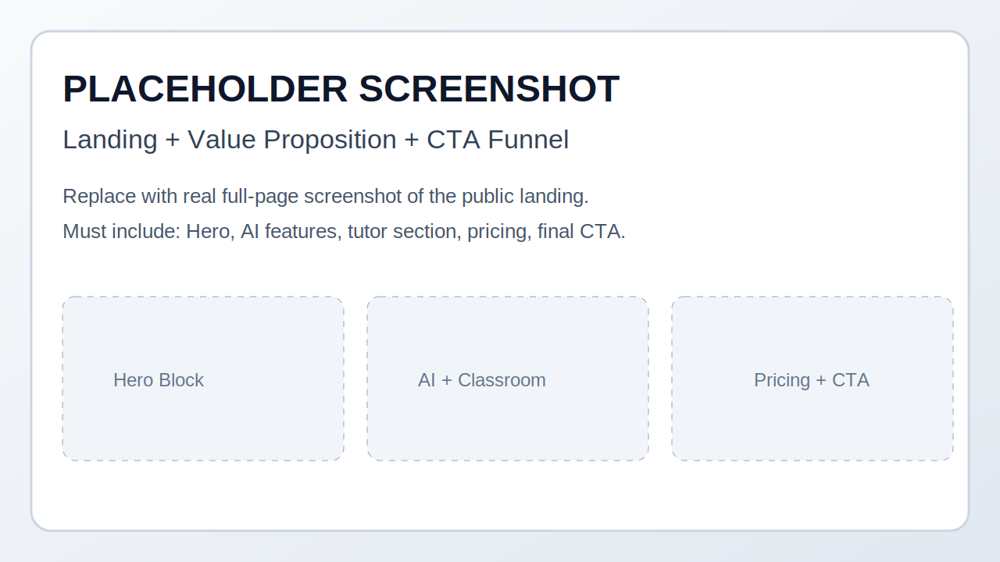
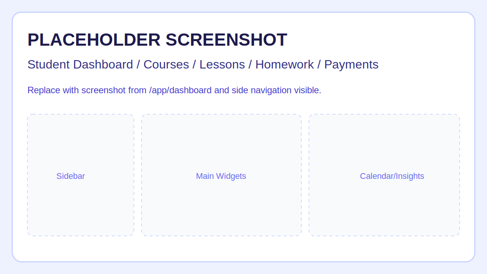
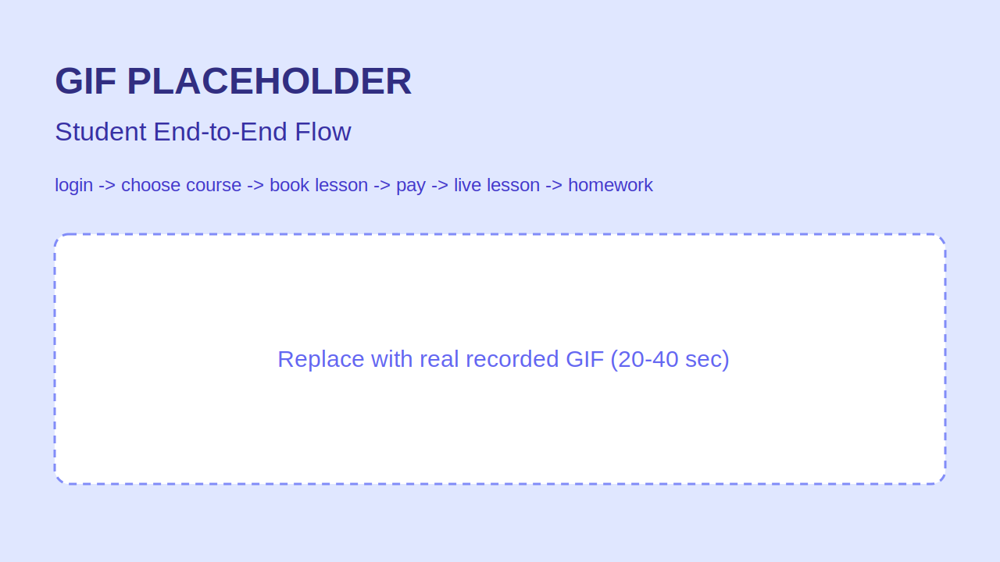
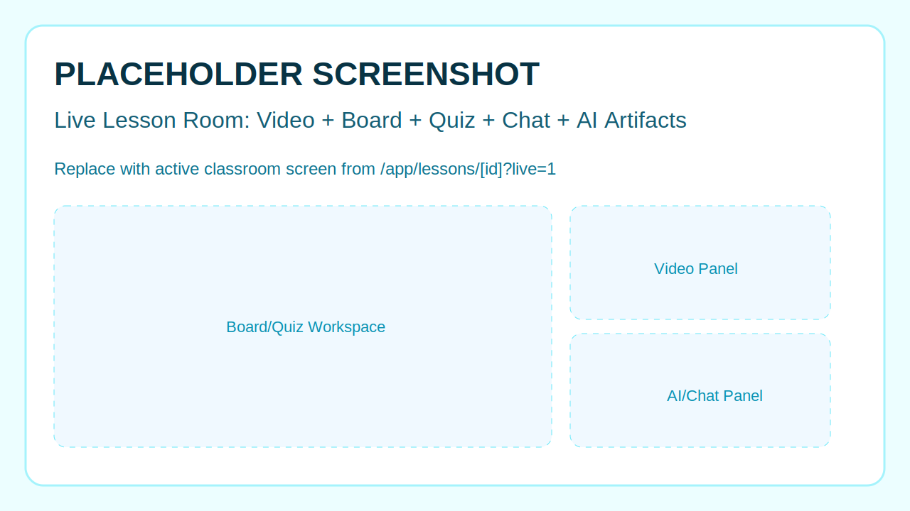
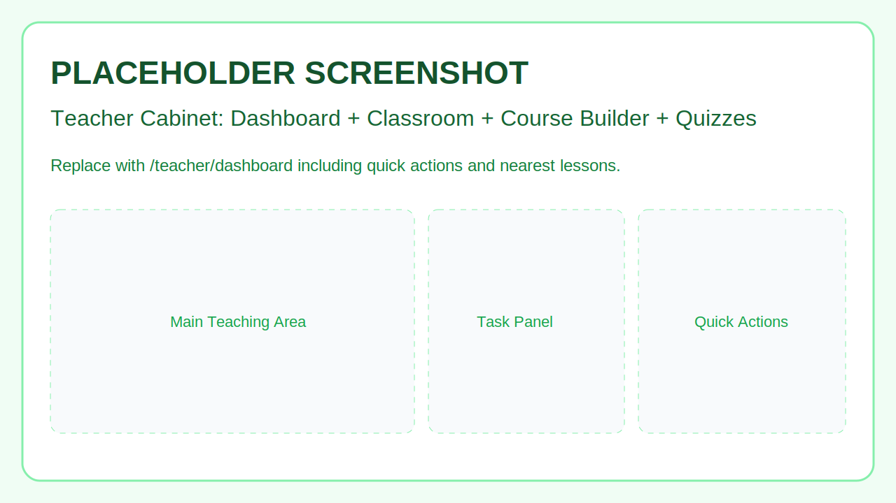
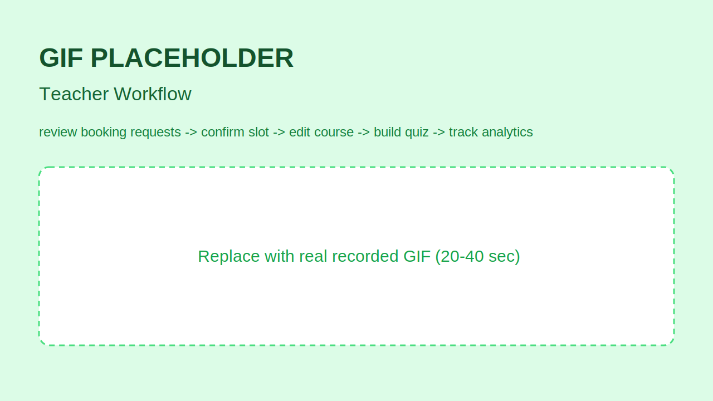
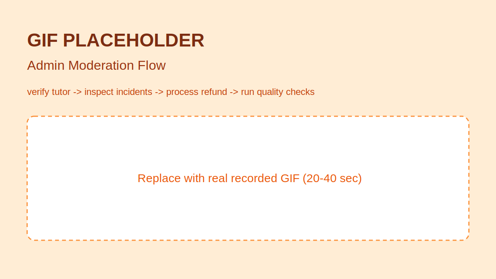
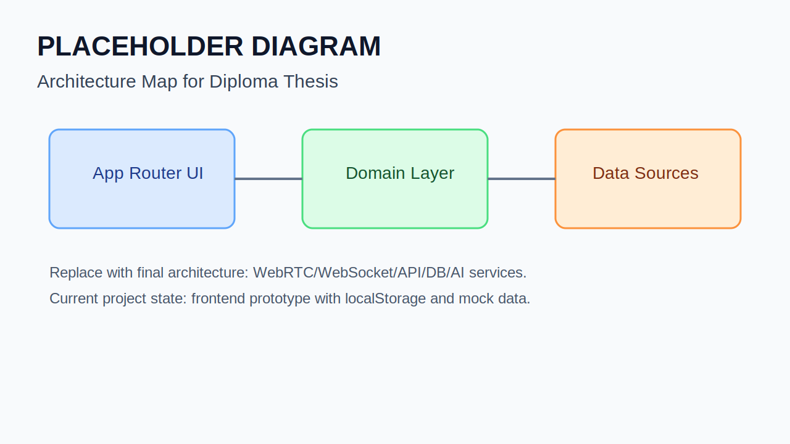

# Дипломная работа
## Интеллектуальная веб-платформа онлайн-репетиторства с ИИ-поддержкой

[](https://nextjs.org/)
[](https://www.typescriptlang.org/)
[](https://tailwindcss.com/)

## Содержание

- [О проекте](#о-проекте)
- [Проблема и цель](#проблема-и-цель)
- [Ключевые преимущества](#ключевые-преимущества)
- [Роли платформы](#роли-платформы)
- [Демонстрация интерфейса](#демонстрация-интерфейса)
- [Функциональные модули](#функциональные-модули)
- [Сквозные сценарии](#сквозные-сценарии)
- [Архитектура](#архитектура)
- [Структура проекта](#структура-проекта)
- [Технологический стек](#технологический-стек)
- [Статус реализации и roadmap](#статус-реализации-и-roadmap)
- [Запуск проекта](#запуск-проекта)
- [Демо-маршруты](#демо-маршруты)

## О проекте

Этот репозиторий реализует дипломную тему: **интеллектуальная веб-платформа для онлайн-репетиторства с интеграцией ИИ в учебный процесс**.

Платформа проектируется как единая среда для:

- проведения онлайн-занятий;
- совместной работы преподавателя и ученика во время урока;
- сопровождения обучения между уроками;
- операционного управления качеством и процессами на стороне администратора.

Проект покрывает полный продуктовый контур по ролям: `ученик`, `преподаватель`, `администратор`.

## Проблема и цель

### Проблема

Большинство популярных образовательных решений закрывают только отдельные части процесса: видеосвязь, каталог преподавателей, тесты или домашние задания. В результате учебный цикл разорван между несколькими сервисами, а преподаватель тратит время на рутинные операции.

### Цель дипломной работы

Построить прототип платформы, которая объединяет в одном продукте:

- расписание, бронирование и оплату занятий;
- live-урок с интерактивным контуром;
- инструменты сопровождения обучения;
- ИИ-поддержку (распознавание речи, объяснение, рекомендации, конспект).

## Ключевые преимущества

1. **Единый учебный цикл**: от выбора преподавателя и бронирования до урока, оплаты, домашней работы и аналитики.
2. **Ролевая операционная модель**: отдельные рабочие контуры для ученика, преподавателя и администратора без смешения задач.
3. **Готовность к ИИ-интеграциям**: структура модулей позволяет подключать ASR, автоконспект, проверку ответов и рекомендательные алгоритмы.
4. **Прозрачные бизнес-сценарии**: поддержан жизненный цикл заявок на занятия и заявок преподавателей с понятными статусами.
5. **Масштабируемая архитектура**: текущая реализация уже разделена по доменным зонам, что упрощает переход к production backend.

## Роли платформы

| Роль | Основная ценность | Ключевые задачи |
| --- | --- | --- |
| Ученик | Управление персональной траекторией обучения | Курсы, занятия, live-урок, домашние задания, словарь, оплата, аналитика |
| Преподаватель | Управление учебным процессом и контентом | Календарь, обработка заявок, редактирование курсов, квизы, коммуникация, выплаты |
| Администратор | Контроль качества и операций платформы | Модерация преподавателей, управление пользователями, инциденты, возвраты, quality-метрики |

## Демонстрация интерфейса

Ниже размещены заглушки, показывающие, какие скриншоты и GIF должны быть в финальной версии README.

### 1. Публичный контур



### 2. Контур ученика





### 3. Live-урок



### 4. Контур преподавателя





### 5. Контур администратора




### 6. Архитектурная схема



## Функциональные модули

### Публичная зона

- лендинг с продуктовой воронкой и ценностным предложением;
- предварительное тестирование уровня знаний (`/assessment`);
- каталог преподавателей и публичные профили (`/teachers`, `/teachers/[id]`);
- формы лидогенерации для ученика и преподавателя (`/lead`, `/for-tutors`);
- юридические и информационные страницы.

### Личный кабинет ученика

- дашборд с KPI, задачами, календарем и AI-инсайтами;
- каталог курсов и страница курса с модульной структурой;
- просмотр unit-материалов и прогресса обучения;
- модуль занятий: календарь, статусы заявок, карточки уроков, детали урока;
- live-комната урока (интерфейс совместной работы и взаимодействия);
- домашние задания с различными сценариями проверки;
- словарь с группировкой и режимом повторения;
- сообщения с преподавателями;
- аналитика обучения и платежный раздел.

### Личный кабинет преподавателя

- дашборд с оперативными показателями и задачами;
- онбординг преподавателя и отображение статуса модерации;
- classroom-центр с календарем и управлением заявками на занятия;
- управление курсами и редактор контента;
- конструктор квизов и просмотр результатов;
- коммуникация с учениками, аналитика и выплаты.

### Административная панель

- обзор операционных показателей;
- модерация заявок преподавателей;
- управление ролями и статусами пользователей;
- контроль инцидентов по занятиям;
- управление платежными спорами и возвратами;
- quality-раздел с метриками и операционными проверками.

### Доменные процессы, уже отраженные в логике

- жизненный цикл записи на урок: `pending -> awaiting_payment -> paid` + ветки `reschedule_proposed`, `declined`, `cancelled`;
- жизненный цикл заявки преподавателя: `pending`, `approved`, `rejected`;
- синхронизация состояния между кабинетами через локальные хранилища браузера.

## Сквозные сценарии

### Ученик

1. Выбирает курс или преподавателя.
2. Отправляет заявку на слот занятия.
3. Получает подтверждение или предложение переноса.
4. Оплачивает подтвержденный слот.
5. Проходит урок и выполняет пост-урочные активности.

### Преподаватель

1. Получает заявку на занятие.
2. Подтверждает, отклоняет или предлагает перенос.
3. После оплаты видит занятие в актуальном расписании.
4. Управляет материалами курса и тестами.

### Администратор

1. Обрабатывает заявки преподавателей.
2. Контролирует пользователей и состояние платформы.
3. Ведет операционные процессы по инцидентам и платежам.

## Архитектура

### Текущая реализация

- Next.js App Router как единая клиентская оболочка;
- доменные данные и сценарии в `data/*`;
- бизнес-утилиты в `lib/*`;
- клиентские модули по ролям в `components/*`;
- локальное персистентное состояние через `localStorage`.

### Целевая архитектура по дипломному плану

- frontend (role-based web client);
- backend API и доменная серверная логика;
- realtime-слой (WebRTC/WebSocket);
- AI-сервисы (ASR, генерация конспекта, объяснение, рекомендации);
- база данных (пользователи, уроки, задания, результаты, словарь, заметки);
- тестовый и quality-контур (unit/integration/e2e, UX и AI-метрики).

## Структура проекта

```text
app/                  маршруты и ролевые зоны (public, student, teacher, admin)
components/           UI-модули по доменам и ролям
data/                 типизированные мок-данные и сценарные наборы
lib/                  доменная клиентская логика и утилиты состояния
hooks/                прикладные React hooks (фильтрация, календарь и т.д.)
public/               статические ассеты интерфейса
docs/readme-assets/   изображения и GIF для README (сейчас заглушки)
Plan_isprav.docx      план дипломной работы
```

### Ключевые доменные файлы

- `lib/lesson-bookings.ts`: модель и операции по заявкам на занятия;
- `lib/tutor-applications.ts`: модель и операции по заявкам преподавателей;
- `lib/demo-role.ts`: демо-авторизация и маршрутизация по роли.

## Технологический стек

### В текущей реализации

- Next.js 14 (App Router)
- React 18
- TypeScript
- Tailwind CSS
- Radix UI
- Lucide Icons

### В целевой версии платформы

- Node.js / NestJS (backend)
- PostgreSQL (хранение доменных сущностей)
- WebRTC + WebSocket (realtime-компоненты)
- Python/FastAPI + AI API (интеллектуальные сервисы)

## Статус реализации и roadmap

### Реализовано

- полный ролевой UI-контур платформы;
- ключевые пользовательские сценарии ученика, преподавателя и администратора;
- доменная логика заявок на занятия и заявок преподавателей;
- маршруты и состояния, отражающие жизненный цикл основных процессов.

### В разработке

- backend API и постоянное хранилище данных;
- production-аутентификация и RBAC;
- полноценный realtime-контур урока;
- интеграция реальных AI-сервисов;
- автоматизированные тестовые контуры и CI/CD.

## Запуск проекта

### Требования

- Node.js 18+
- npm 9+

### Установка зависимостей

```bash
npm install
```

### Режим разработки

```bash
npm run dev
```

Приложение будет доступно по адресу: `http://localhost:3000`.

### Production-сборка

```bash
npm run build
npm run start
```

### Проверка линтером

```bash
npm run lint
```

## Демо-маршруты

- Ученик: `/login?role=student` -> `/app/dashboard`
- Преподаватель: `/login?role=teacher` -> `/teacher/dashboard`
- Администратор: `/login?role=admin` -> `/admin/dashboard`

## Что заменить перед финальной презентацией

1. Заглушки в `docs/readme-assets/*` на реальные скриншоты и GIF.
2. Архитектурный placeholder на итоговую диаграмму из диплома.
3. При наличии backend-части дополнить README ссылками на API и схемой данных.
